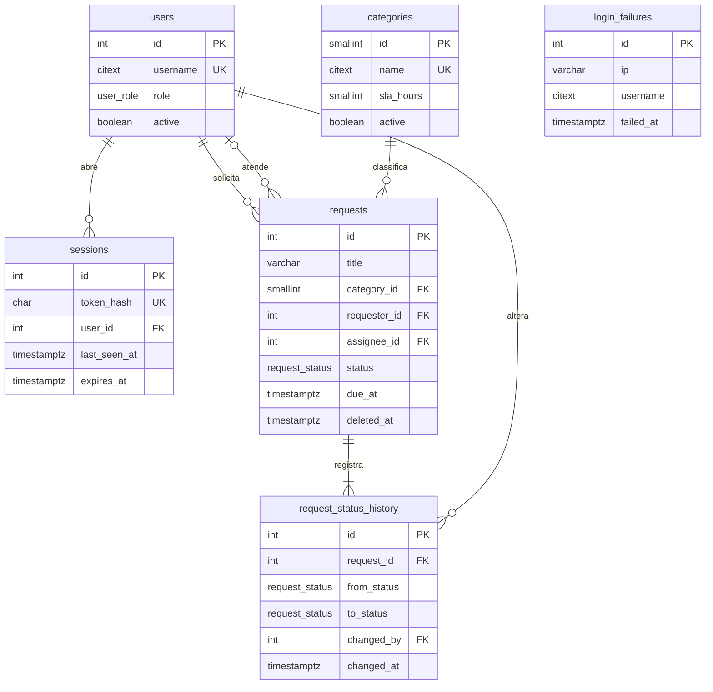

# Dicionário de Dados

Banco PostgreSQL 18, seis tabelas, dois tipos enumerados e a extensão `citext`.

Os scripts de criação são as migrações em [`backend/prisma/migrations/`](../backend/prisma/migrations/), aplicadas em ordem, a partir de [`backend/prisma/schema.prisma`](../backend/prisma/schema.prisma):

| Migração | O que faz |
| --- | --- |
| `20260930102819_init` | Cria as tabelas, os tipos enumerados e as chaves estrangeiras |
| `20261005084126_integrity_and_indexes` | Acrescenta as regras de integridade (`CHECK`, `citext`, `users.active`) e os índices por consulta |
| `20261005120000_assignee_timezone_login_failures` | Acrescenta o responsável (`requests.assignee_id`), a exclusão lógica (`requests.deleted_at`) e a tabela `login_failures`, com os `CHECK` e os índices delas. Preenche o responsável das solicitações que já saíram de Aberto com quem as levou para Em Atendimento, tirado do histórico |

É SQL puro: roda com `psql -f`, um arquivo depois do outro, num banco vazio, ou com `pnpm --filter backend db:deploy`, que é o que o container da API faz ao subir.

## Diagrama



O diagrama mostra as chaves e as colunas que explicam as relações; as demais colunas estão nas seções de cada tabela.

## Convenções

- Tabelas e colunas em inglês, `snake_case`, tabelas no plural.
- Chaves primárias inteiras geradas pelo banco (`SERIAL`; `SMALLSERIAL` em `categories`).
- Datas em `timestamptz(3)`: o instante é guardado em UTC, com milissegundos, e convertido para o horário local só na tela.
- As regras de dado valem nos dois lugares: a API valida antes (schemas em `shared/src/`, com a mensagem para a tela) e o banco garante com `CHECK`, porque a API não é o único caminho até ele (usuários e categorias novos entram por SQL). Cada `CHECK` está na tabela da sua coluna.
- Login e nome de categoria são `citext` (extensão do PostgreSQL): o banco compara sem diferenciar maiúsculas, então "Ana" e "ana" são o mesmo login e "TI" e "ti" não coexistem. Como `citext` não tem limite de tamanho, o limite vai no `CHECK`.
- Todo instante gravado pela API (abertura, prazo, histórico, exclusão, sessão, erro de login) sai do relógio dela, não do `now()` do banco: o "fora do prazo" da lista, do detalhe e do painel é medido na mesma régua. Os `DEFAULT CURRENT_TIMESTAMP` ficam para quem insere direto por SQL; é o caso de `users.created_at`, que só registra o cadastro e não entra em regra nenhuma.
- Cada índice existe por uma consulta da API, citada na tabela.

## Tipos enumerados

| Tipo | Valores | Significado |
| --- | --- | --- |
| `user_role` | `REQUESTER`, `AGENT` | Perfil do usuário: colaborador (quem abre solicitações) ou atendente |
| `request_status` | `OPEN`, `IN_PROGRESS`, `DONE` | Aberto, Em Atendimento, Concluído |

## `users` — usuários

| Coluna | Tipo | Nulo | Padrão | Descrição |
| --- | --- | --- | --- | --- |
| `id` | `serial` | não | sequência | Identificador (PK) |
| `name` | `varchar(120)` | não | | Nome exibido nas telas. `CHECK`: não vazio |
| `username` | `citext` | não | | Login; único sem diferenciar maiúsculas. `CHECK`: de 1 a 40 caracteres, sem espaço nas pontas |
| `password_hash` | `varchar(255)` | não | | Hash Argon2id da senha; a senha em si nunca é gravada |
| `role` | `user_role` | não | `REQUESTER` | Perfil de acesso |
| `active` | `boolean` | não | `true` | Desativado não entra e perde na hora as sessões abertas. Quem sai da empresa é desativado, não apagado: o `RESTRICT` das solicitações e do histórico impede apagar, e o histórico precisa continuar dizendo quem fez o quê |
| `created_at` | `timestamptz(3)` | não | `CURRENT_TIMESTAMP` | Data do cadastro |

Índice único: `users_username_key (username)`.

## `sessions` — sessões de login

Uma linha por login ativo. O logout apaga a linha; uma sessão expirada é apagada na primeira vez em que é usada.

| Coluna | Tipo | Nulo | Padrão | Descrição |
| --- | --- | --- | --- | --- |
| `id` | `serial` | não | sequência | Identificador (PK) |
| `token_hash` | `char(64)` | não | | SHA-256, em hexadecimal, do token de sessão. O token em si só existe no cookie do navegador |
| `user_id` | `integer` | não | | FK → `users.id`, `ON DELETE CASCADE` |
| `created_at` | `timestamptz(3)` | não | `CURRENT_TIMESTAMP` | Momento do login |
| `last_seen_at` | `timestamptz(3)` | não | `CURRENT_TIMESTAMP` | Último uso da sessão; base da expiração por inatividade (30 min) |
| `expires_at` | `timestamptz(3)` | não | | Limite absoluto da sessão (login + 8 h). `CHECK`: depois de `created_at` |

Índices: único `sessions_token_hash_key (token_hash)`, a busca de toda requisição autenticada; `sessions_user_id_idx (user_id)`, a chave estrangeira; `sessions_expires_at_idx (expires_at)`, para a limpeza das sessões vencidas.

## `categories` — categorias de solicitação

| Coluna | Tipo | Nulo | Padrão | Descrição |
| --- | --- | --- | --- | --- |
| `id` | `smallserial` | não | sequência | Identificador (PK) |
| `name` | `citext` | não | | Nome da categoria; único sem diferenciar maiúsculas. `CHECK`: de 1 a 60 caracteres, sem espaço nas pontas |
| `active` | `boolean` | não | `true` | Só categorias ativas aparecem no formulário e são aceitas em solicitações novas |
| `sla_hours` | `smallint` | não | | Prazo de atendimento das solicitações da categoria, em horas. `CHECK`: maior que zero (com zero, toda solicitação nasceria fora do prazo) |

Índice único: `categories_name_key (name)`.

## `requests` — solicitações

| Coluna | Tipo | Nulo | Padrão | Descrição |
| --- | --- | --- | --- | --- |
| `id` | `serial` | não | sequência | Identificador (PK). O código exibido (`SOL-000001`) é este número com seis dígitos; não existe coluna de código |
| `title` | `varchar(120)` | não | | Título. `CHECK`: de 3 a 120 caracteres |
| `description` | `text` | não | | Descrição. `CHECK`: de 1 a 2000 caracteres |
| `category_id` | `smallint` | não | | FK → `categories.id`, `ON DELETE RESTRICT` |
| `requester_id` | `integer` | não | | FK → `users.id`, `ON DELETE RESTRICT`. Quem abriu; preenchido com o usuário da sessão |
| `assignee_id` | `integer` | sim | | FK → `users.id`, `ON DELETE RESTRICT`. Responsável pelo atendimento: o atendente que levou a solicitação para Em Atendimento; só ele a conclui. `CHECK` (`requests_assignee_check`): nulo exatamente quando o status é `OPEN` |
| `status` | `request_status` | não | `OPEN` | Situação atual. Repete o `to_status` do último registro do histórico, de propósito: a lista e o painel leem o status sem juntar o histórico. A API grava os dois na mesma transação |
| `due_at` | `timestamptz(3)` | não | | Prazo de atendimento: `sla_hours` da categoria contadas em horas úteis a partir de `created_at` (segunda a sexta, das 08:00 às 18:00, no fuso `APP_TIMEZONE`, sem feriados; aberta fora do expediente, começa a contar no próximo início de expediente). Gravado na abertura. Se a categoria for trocada na edição, passa a valer o menor entre o prazo atual e o refeito com o SLA novo: trocar de categoria nunca adia o prazo. Gravado, e não calculado na consulta, para que mudar o SLA da categoria não altere prazos já assumidos. `CHECK`: depois de `created_at` |
| `created_at` | `timestamptz(3)` | não | `CURRENT_TIMESTAMP` | Data de abertura |
| `updated_at` | `timestamptz(3)` | não | | Última alteração; preenchido pela aplicação a cada gravação |
| `deleted_at` | `timestamptz(3)` | sim | | Exclusão lógica: o instante em que quem abriu excluiu a solicitação; nulo enquanto ela existe. Excluída não aparece na lista, no detalhe (a API responde 404) nem no painel, mas a linha e o histórico ficam no banco. `CHECK` (`requests_deleted_at_check`): só preenchido com o status `OPEN`, porque só se exclui em Aberto e uma excluída não muda mais de status |

Índices, cada um pela consulta que atende:

- `requests_requester_id_created_at_idx (requester_id, created_at DESC)`: a lista do colaborador (`WHERE requester_id = ? ORDER BY created_at DESC`). Também serve à chave estrangeira, por começar por `requester_id`.
- `requests_created_at_idx (created_at DESC)`: a lista do atendente, que vê todas, e o filtro por período.
- `requests_status_due_at_idx (status, due_at)`: "fora do prazo" no painel e no filtro (`status <> 'DONE' AND due_at < agora`).
- `requests_category_id_idx (category_id)`: a chave estrangeira (a checagem do `RESTRICT`) e o filtro por categoria.
- `requests_assignee_id_idx (assignee_id)`: a chave estrangeira; sem ele, apagar um usuário varreria `requests` para conferir o `RESTRICT`.

Não há índice só em `status`: com três valores possíveis, ele quase não filtra. Pelo mesmo motivo não há índice em `deleted_at`: toda consulta filtra `deleted_at IS NULL`, condição que quase todas as linhas atendem.

A exclusão é lógica e a API só a permite enquanto a solicitação está em `OPEN`: excluir grava `deleted_at`, e a linha e o histórico continuam no banco. Editar e excluir conferem dono e status na própria gravação (`WHERE id = ? AND requester_id = ? AND status = 'OPEN' AND deleted_at IS NULL`), para que um atendimento iniciado no mesmo instante não seja atropelado. Mudar o status confere o status lido e, para concluir, também o responsável (`AND assignee_id = ?`).

## `request_status_history` — histórico de status

Uma linha na abertura e uma a cada mudança de status. É o que a tela de detalhe mostra e de onde saem, no painel, os dois tempos médios (até o início e até a conclusão) e as concluídas fora do prazo.

| Coluna | Tipo | Nulo | Padrão | Descrição |
| --- | --- | --- | --- | --- |
| `id` | `serial` | não | sequência | Identificador (PK) |
| `request_id` | `integer` | não | | FK → `requests.id`, `ON DELETE CASCADE`. A exclusão pela API é lógica e não apaga a linha, então o histórico fica; o `CASCADE` só age num `DELETE` feito direto por SQL |
| `from_status` | `request_status` | sim | | Status anterior; nulo no registro de abertura |
| `to_status` | `request_status` | não | | Status novo. `CHECK`: diferente de `from_status`, e `from_status` é nulo exatamente quando `to_status` é `OPEN` (só a abertura não tem origem) |
| `changed_by` | `integer` | não | | FK → `users.id`, `ON DELETE RESTRICT`. Quem abriu ou quem mudou o status |
| `changed_at` | `timestamptz(3)` | não | `CURRENT_TIMESTAMP` | Momento da mudança. No registro de abertura é igual ao `created_at` da solicitação |

Índice: `request_status_history_request_id_changed_at_idx (request_id, changed_at)`, o histórico de uma solicitação em ordem, na tela de detalhe.

## `login_failures` — tentativas de login erradas

Uma linha por login recusado, para o limite de tentativas. Fica no banco, e não na memória do processo, para a contagem valer com várias instâncias da API e continuar depois de um reinício. A cada tentativa a API apaga as linhas com mais de um minuto, grava a linha da tentativa antes de conferir a senha e conta as do último minuto: responde 429 a partir de 5 erros do mesmo usuário vindos do mesmo IP ou de 20 erros do mesmo IP somando usuários. Gravar antes de contar impede que tentativas simultâneas passem todas pela contagem zerada. A linha fica se a senha estiver errada e sai se estiver certa (com os erros anteriores daquele usuário naquele IP) ou se a tentativa for recusada pelo limite.

| Coluna | Tipo | Nulo | Padrão | Descrição |
| --- | --- | --- | --- | --- |
| `id` | `serial` | não | sequência | Identificador (PK) |
| `ip` | `varchar(45)` | não | | IP de origem, em texto; 45 caracteres cabem o IPv6 mais longo |
| `username` | `citext` | não | | Login tentado, exista ou não; `citext` para "Ana" e "ana" contarem juntos. `CHECK`: de 1 a 40 caracteres, o mesmo limite do login. Não é chave estrangeira, porque o login digitado pode não existir |
| `failed_at` | `timestamptz(3)` | não | | Momento da tentativa, pelo relógio da API |

Índices, cada um pela contagem que atende:

- `login_failures_username_ip_failed_at_idx (username, ip, failed_at)`: erros do mesmo usuário vindos do mesmo IP no último minuto, e a remoção desses erros num login certo.
- `login_failures_ip_failed_at_idx (ip, failed_at)`: erros do mesmo IP somando todos os usuários.

## Relacionamentos

```txt
users      1 ── N sessions                  (sessions.user_id, CASCADE)
users      1 ── N requests, como quem abriu (requests.requester_id, RESTRICT)
users      1 ── N requests, como responsável (requests.assignee_id, RESTRICT; nulo em Aberto)
categories 1 ── N requests                  (requests.category_id, RESTRICT)
requests   1 ── N request_status_history    (request_status_history.request_id, CASCADE)
users      1 ── N request_status_history    (request_status_history.changed_by, RESTRICT)
```

`login_failures` não se liga a nenhuma tabela: guarda o login digitado, que pode não existir.

`RESTRICT` impede apagar um usuário ou uma categoria que já tenha solicitações: usuário que sai da empresa e categoria que sai de uso são desativados (`active = false`), não apagados.

## Dados de demonstração

Criados por `backend/src/seed.ts` na subida do container da API. O seed pode rodar várias vezes: não duplica nem sobrescreve o que já existe.

| Categoria | `sla_hours` |
| --- | --- |
| TI | 24 |
| Infraestrutura | 48 |
| RH | 72 |
| Financeiro | 72 |
| Compras | 120 |

| Usuário | Nome | Perfil |
| --- | --- | --- |
| `ana` | Ana Souza | `REQUESTER` |
| `bruno` | Bruno Lima | `REQUESTER` |
| `carla` | Carla Mendes | `AGENT` |

A senha dos três é `Senha@123`. Num banco sem nenhuma solicitação, o seed cria também dez de exemplo, da `ana` e do `bruno`, com datas contadas a partir da subida: há casos no prazo, fora do prazo, em atendimento e concluídos, cada um com o histórico completo (abertura e cada mudança, feita pela `carla`, que é a responsável pelas que saíram de Aberto). Os prazos seguem a mesma conta em horas úteis da API, no fuso `APP_TIMEZONE`.
